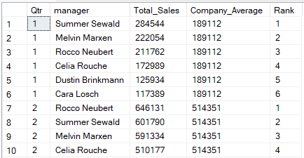
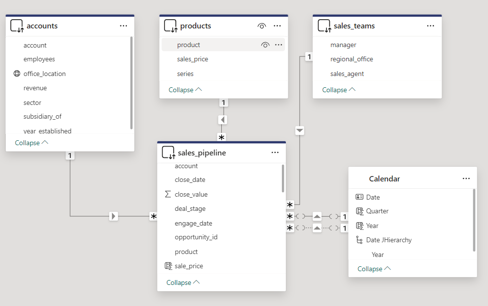
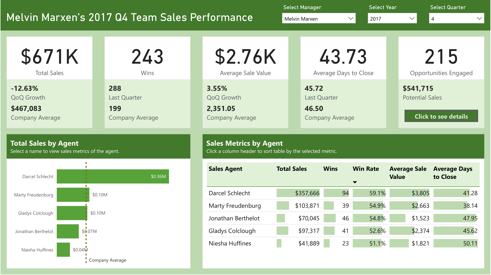
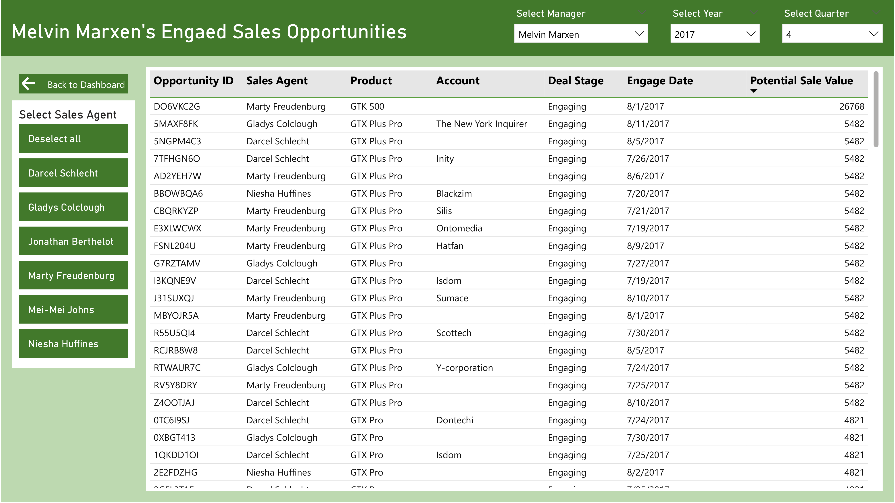
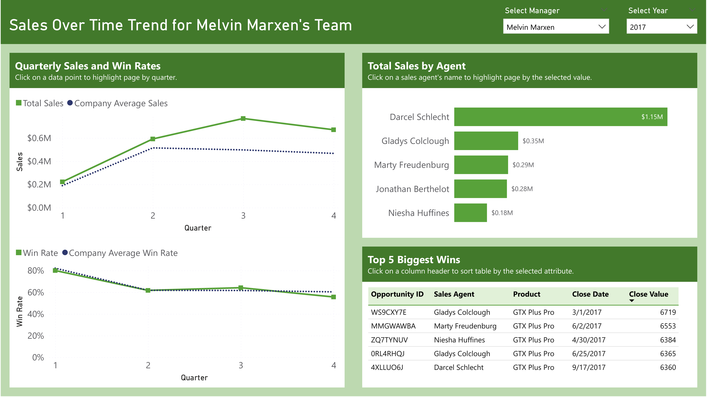
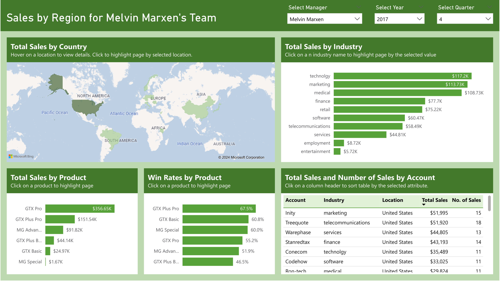
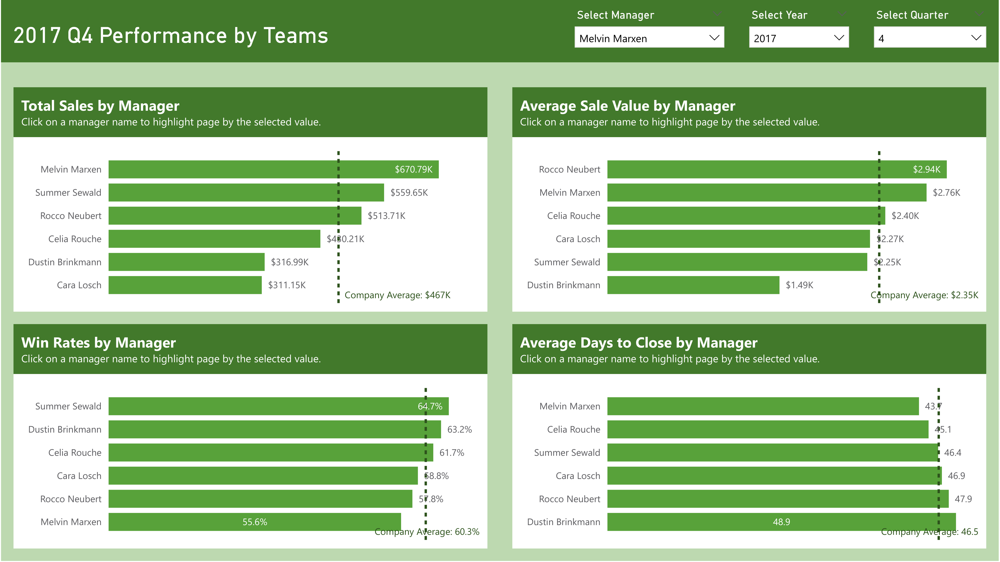

# CRM Sales Dashboard - End-to-End SQL and Power BI Project

# Project Overview

The project designs an interactive dashboard for sales team managers of a company selling computer hardware to large businesses to keep track of sales performance of their team. The dashboard project utilizes SQL to clean and explore data and Power BI to create the interactive dashboard.

Dataset Source: [CRM Sales Opportunities on Maven Analytics](https://mavenanalytics.io/data-playground)

[Maven Sales Challenge](https://mavenanalytics.io/challenges/maven-sales-challenge/8f59bcfa-d310-4947-b3d8-917b3cce270e)

Project Link:

GitHub Link:

Tools Used: #SQL #PowerBI

Data Analysis Skills: #ETL #DataCleaning #ExploratoryDataAnalysis #DataModeling #DataVisualization #DashboardBuilding 


# Project Background

The project assumes the role of a Power BI developer for a company selling computer hardware to large businesses. The company has been using a new CRM system and aims to develop an interactive dashboard that sales managers can use to track the team's quarterly performance e and sales opportunities.

# Objective

The main objective is to create an interactive dashboard that sales managers can use to answer the following questions:
- How is the sales performance of the team for the given quarter?
- How is the team performing relative to the company average?
- What are the quarter-on-quarter sales trends of a team?
- How is each salesperson currently performing?
- What are the top selling products?

# About The Dataset

The dataset contains four tables:
- `accounts` - Account details of clients including company name, industry, year established, number of employees, annual revenue, location, and parent company.
- `products` - Details of products offered including product name, series, and sale price.
- `sales_pipeline` - Records of sales opportunities with details including sales agent, product name, company name, sales pipeline stage, date of first engagement, date of closing a deal, and revenue.
- `sales_teams` - Details of each sales agent including name, name of manager, and regional office.

The four tables were imported to a database in Microsoft SQL Server to better simulate a real-world data infrastructure.

# Data Profiling in SQL

Data profiling was performed to identify relevant data and potential anomalies, outliers, or other data quality issues that need to be handled prior to exploratory data analysis.

## Sales Pipeline

The table contains 8800 records of sales opportunities.

Number o missing values:
- `account` - 1425, 1088 are in engaging stage and 337 are in prospecting stage.
- `engage_date` - 500, all are in processing stage with no close date and close value.
- `close_date` and `close_value` - 2089, equal to the sum of number of opportunities in the prospecting or engaging stage.

Spelling inconsistencies:
- product column has a value "GTXPro" which is spelled as "GTX Pro" on the products dimension table. The value was replaced to be consistent with the dimension table using the following query:
	```SQL
	UPDATE sales_pipeline
	SET [product] = 'GTX Pro'
	WHERE [product] = 'GTXPro'
	```

# Accounts and Products 

The products table contains 3 product series with a combined total of 7 products. The accounts table contains 85 distinct accounts. Relevant columns for both tables have no missing or anomalous values.

## Sales Teams

There are 3 regional offices in the table:
- Central has 2 managers and total of 11 sales agents.
- East has 2 managers and 12 sales agents.
- West has 2 managers and 12 sales agents.

There are 5 sales agents that were not on the sales pipeline table. As there is no additional data to explain this discrepancy, an assumption is made that these sales agents are newly recruited and have not started prospecting opportunities.

While the dataset contains several missing values, these are expected and should be left as is. The cleaned tables are of adequate quality and ready for data exploration.

# Exploratory Data Analysis (EDA)

Exploring the dataset allows us to discover trends and relationships in the data and serves as a reference on what to expect during dashboard building.

The quarterly sales for 2017 Q1 by team, including total sales and average sale value, were calculated using the following query.
```SQL
SELECT
	manager, 
	SUM(close_value) AS Total_Sales,
	AVG(close_value) AS Average_Sale_Value
FROM sales_pipeline AS sp
RIGHT JOIN sales_teams AS st
ON sp.sales_agent = st.sales_agent
WHERE 
	deal_stage ='Won'
	AND YEAR(close_date) = 2017
	AND DATEPART(QUARTER, close_date) = 4
GROUP BY manager
ORDER BY Total_Sales DESC
```

Wins and win rates were also calculated for the same period using the following query to create a pivot table.
```SQL
WITH SourceTable AS (
	SELECT opportunity_id, manager, deal_stage
	FROM sales_pipeline AS sp
	RIGHT JOIN sales_teams AS st
	ON sp.sales_agent = st.sales_agent
	WHERE 
		YEAR(close_date) = 2017
		AND DATEPART(QUARTER, close_date) = 4
)
SELECT
	manager, 
	[Won], [Lost], 
	CAST([Won] AS FLOAT) / ([Won] + [Lost]) * 100 AS Win_Rate
FROM SourceTable
PIVOT(
	COUNT(opportunity_id) FOR deal_stage IN ([Won], [Lost])
) AS PivotTable
ORDER BY Win_Rate DESC
```

The average days to close was calculated through the following query.
```SQL
SELECT
	manager,
	AVG(
		CAST(
			DATEDIFF(DAY, engage_date, close_date) 
			AS FLOAT
		)
	) AS Average_Days_To_Close
FROM sales_pipeline AS sp
RIGHT JOIN sales_teams AS st
ON sp.sales_agent = st.sales_agent
WHERE 
	close_date IS NOT NULL
	AND YEAR(close_date) = 2017
	AND DATEPART(QUARTER, close_date) = 4
GROUP BY manager
ORDER BY Average_Days_To_Close
```
Melvin Marxen has the highest total sales but lowest win rate. His high wins and low average days to close likely made up for the lost deals. Dustin Brinkmann, on the other hand, has the lowest sales despite the high win rate, which can be explained by the low average sale value and the longest average days to close.

Sales metrics were also calculated by sales agents. Darcel Schlecht has the highest total sales, making up more than half of Melvin Marxen's team sales.

A table of engaged opportunities with their respective potential sale values showed that Celia Rouche's team has several engaged opportunities with the product GTK 500. This product has the highest potential sale value, and analysis of sales by product showed that GTK 500 only has 3 sales and a win rate of 43%. This insight presents an opportunity for Celia Rouche's team to close high value sales next quarter. Having this information in the dashboard will help guide team managers to identify which ongoing opportunities to focus on.

Analysis of sales by region shows that United States have the highest sales, followed by Panama and Korea. The top selling industries are retail, technology, and medical. Having these trends available on the dashboard will help guide team managers in prospecting new clients.

Sales by quarter and manager was calculated with total sales, company average, and rank of managers per a given quarter using the following query.
```SQL
WITH qtr_sales_by_manager AS (
	SELECT
		DATEPART(QUARTER, close_date) AS 'Qtr',
		manager,
		SUM(close_value) AS Total_Sales
	FROM sales_pipeline AS sp
	LEFT JOIN sales_teams AS st
	ON sp.sales_agent = st.sales_agent
	WHERE YEAR(close_date) = 2017
	GROUP BY DATEPART(QUARTER, close_date), manager
)
SELECT *,
	AVG(Total_Sales) OVER(PARTITION BY Qtr) AS 'Company_Average',
	RANK() OVER(PARTITION BY Qtr ORDER BY Total_Sales DESC)
FROM qtr_sales_by_manager
ORDER BY Qtr, Total_Sales DESC
```

The resulting table looks like this.



The results show that Summer Sewald, Melvin Marxen, and Rocco Neubert consistently ranked higher while the three other managers consistently ranked lower. Such insight can be used by team managers to track their performance over time relative to all other teams.

Accurate data is indispensable for driving informed business decisions as erroneous calculations can mislead stakeholders into making decisions that will negatively impact the business. The complete exploratory data analysis can be used as a reference to cross-validate calculations in the Power BI report to ensure accuracy of data.

# Dashboard Planning

As the audience of the dashboard is sales team managers who may not be proficient with Power BI reports, the dashboard should be optimized for ease of use, requiring minimal training for its users.

The report will be split into five pages:
- Dashboard - This page enables team managers to quickly track overall team performance as well as the performance of each sales agent. This page will contain the following visuals:
	- KPI cards with sub-cards that provide context to the metric values.
	- Total sales: current, quarter-on-quarter (QoQ) growth, company average
	- Wins (number of successful sales): current, last quarter, company average
	- Average sale value: current, QoQ growth, company average
	- Average days to close a deal: current, last quarter, company average.
	- Number of engaged opportunities: number, potential sales
- Total sales by salesperson with company average as reference line: This enables managers to quickly assess how each sales agent performs compared to the company average.
	- Table of sales, wins, win rates, average sales value, and average days to close for each sale agent.
- Sales opportunities - provides a detailed table of currently engaging opportunities. This enables managers to identify potential sales.
- Sales over time - This page keeps track of sales performance over time. This page will contain the following charts:
	- Line chart of total sales and win rates by quarter.
	- Total sales by salesperson - this can be used to cross-filter other charts on the page.
	- Top 5 biggest wins - top 5 won opportunities with the highest sale value for the given quarter.
- Sales by region - This page keeps track of sales by location, industry, and product category, allowing managers to identify market trends. This page will contain the following charts:
	- Choropleth map of sales by location
	- Sales by industry
	- Sales by product
	- Win rates by product.
	- Table of accounts with total sales and number of sales
- Performance by Team - This page allows managers to track their performance compared to other teams and company average. This page will contain sales, win rates, average sale value, and average days to close by manager.

# Power BI ETL

The four tables were loaded into Power BI from SQL Server through DirectQuery mode. The dataset was quickly inspected in Power Query to ensure the data was loaded properly.

Connecting to a data source via DirectQuery allows Power BI reports to retrieve up-to-date data without requiring the data analyst to do a manual refresh. This enables stakeholders, in this case the sales team managers, to make data-driven decisions in a timely manner.

As I do not have a paid Power BI license, I cannot publish my report into Power BI service, so I made a separate Power BI report to be published in my GitHub repo where the data was loaded through import mode.

# Power BI Data Modeling

A calendar table was created to enable time series analysis such as quarter-on-quarter growth. Table relationships were set such that all dimension tables (`accounts`, `products`, `sales_teams`) and the calendar table filters the `sales_pipeline` table through a one-to-many relationship. The calendar table uses `close_date` as the active relationship and `engage_date` as an inactive relationship. The resulting data model looks like this:



The following measures were created to calculate key performance indicators (KPIs) for use in the dashboard:
- Total sales, quarter-on-quarter (QoQ) sales growth, company average
- Wins, wins last quarter, company average.
- Win rate, win rate last quarter, company average.
- Average sale value, QoQ growth, company average
- Average days to close, last quarter, company average
- Number of opportunities engaged.
- Potential sales from engaged opportunities

The following DAX codes were used for some of the measures:

Quarter-on-quarter sales growth:
```DAX
QoQ Sales Growth =
// Total Sales = SUM(close_value)
VAR SalesLastQtr =
    CALCULATE(
        [Total Sales],
        DATEADD('Calendar'[Date], -1, QUARTER)
    )
RETURN
    DIVIDE([Total Sales] - SalesLastQtr, SalesLastQtr)
```

Win rate.
```DEX
Win Rate =
// Wins = CALCULATE(COUNT([opportunity_id]), sales_pipeline[deal_stage]="Won")
VAR Losses =
    CALCULATE(COUNT([opportunity_id]), sales_pipeline[deal_stage]="Lost")
RETURN
    DIVIDE([Wins], [Wins] + Losses)
```

# Power BI Dashboard Building

The dashboard was built according to the dashboard plan mentioned above. Slicers for manager name, year, and quarter were added to filter the data and were also synchronized across pages.

The Dashboard page displays quarterly KPIs for the team. Clicking on a sales agent's name filters the data to show KPIs specific to the selected sales agent. Clicking column headers in the table sorts the rows by the selected metric. Lastly, clicking on the "Click to see details" button navigates to the Sales Opportunities page.



The Sales Opportunities page contains details of engaged opportunities wth their respective potential sale value. A slicer was created to filter the table by a sales agent.



The Sales Over Time page displays sales and winr ates by quarter. Clicking a data point highlights the page by quarter. A total sales by sales agent chart can be used to filter sales over time chart by the selected agent. Finally, a table of the top 5 biggest wins can also be filtered by quarter and/or by sales agent.



The Sales by Region page has a choropleth map of total sales by country, total sales by industry, total sales and win rates by product, and accounts table, all of which can be used to cross-highlight visuals on the page.



Finally, the performance by team has charts that visualize a manager's performance relative to other teams and with company average as reference lines.



# Conclusion

An interactive dashboard plays a key role for stakeholders to track business performance and make timely data-driven decisions. SQL can be used to profile, clean and explore the data to prepare for dashboard development. Finall, Power BI's ability to connect to SQL databases serves as a useful feature to bridge a data warehouse to reports that inspire imformed business decisions.

The design of my dashboard is inspired by the Maven Sales Challenge winner Kerryn Gresswell's [Sales Snapshot: CRM Insights for Managers project](https://mavenanalytics.io/project/14140).


